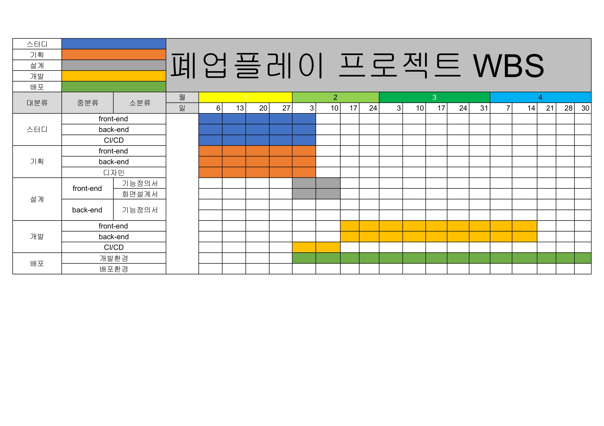
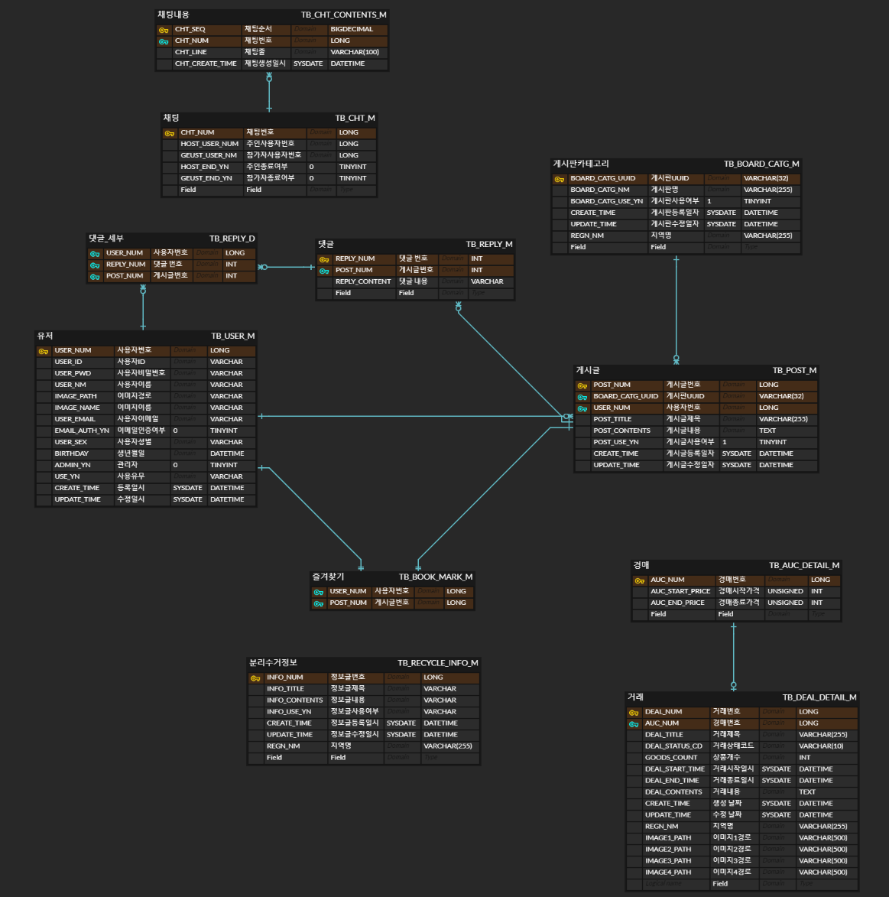

폐업플레이 (2021.02.19 Ver.01)
=============
> 폐업 가게들의 용품을 판매하는 모바일 어플리케이션 서버 프로젝트

## 1. 사용기술
> 1. 언어 : Java
> 2. 프레임워크 : Spring Boot
> 3. Library : JPA(Query DSL), Eureka, Zuul, Kafka(미정)
> 4. DB : Maria DB
> 5. 배포 : AWS S3
> 6. Tool : Git, Slack, Zoom

## 2. 프로젝트 관리

#### 2-1. WBS
> 프로젝트 초기작성 WBS

## 3. 설계
 
> DB 설계

>ERD Cloud 물리설계( Ver.01 )

## 4. 진행 과정 
> 2021-02-18
>> 1. kafka 설정 미완료, AWS EC2에 Kafkka 서버기동만 완료, 이후 
>> 2. message que적용은 검토필요
>> 3. jpa 기본template 완성 -> Query DSL 적용중

***
## 5. 참여자
- [호선][eoohosun]
- [수현][eoohosun]
- [태용][eoohosun]
- [호준][eoohosun]
- [여진][eoohosun]
- [종훈][eoohosun]

[eoohosun]: URL "[Optional Title here](https://github.com/EooHoSun)"
